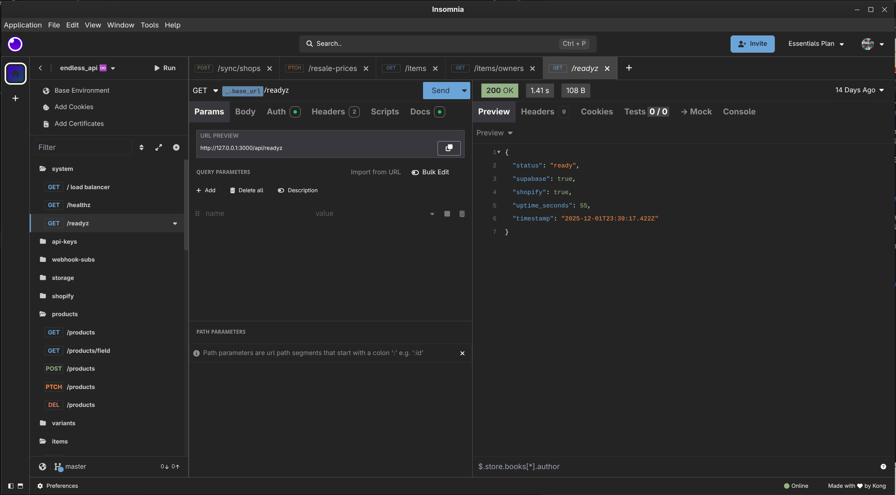

# Postelman Theme

A warm dark theme for Insomnia with a washed black background and comfortable warm colours.



## Installation

```bash
npm install insomnia-plugin-postelman-theme
```

Then restart Insomnia and select **Postelman** from Preferences > Themes.

## Features

- Washed black background (`#242424`) - easier on the eyes
- Warm colour palette - all colours adjusted for comfortable viewing
- Transparent method badges with coloured borders
- Bold text in sidebar and tabs for enhanced readability
- Custom JSON syntax highlighting (blue keys, green numbers/booleans)

## Colour Palette

| Colour  | Hex       | Usage                |
|---------|-----------|----------------------|
| Success | `#95b384` | GET, POST            |
| Notice  | `#ff8c42` | Warnings             |
| Warning | `#d4945f` | Tan accent           |
| Danger  | `#d77a61` | DELETE               |
| Surprise| `#6ba4d9` | JSON keys            |
| Info    | `#7fb3d5` | Light blue accent    |

## License

MIT © John Shields
